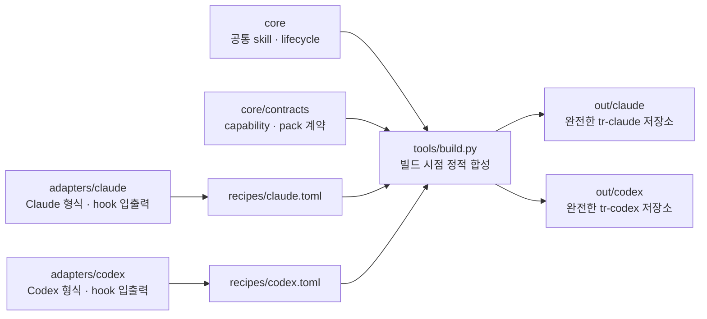

# tr-kit-source

공통 소스 하나에서 Claude와 Codex용 개발 워크플로 kit를 정적으로 조립하고 배포한다.

## 구조
```
glossary/   ② 토큰 값 — _schema.toml(정본) + <target>.toml(값). 드리프트 fail-closed.
recipes/    실행 가능한 TOML 조립계획 — _schema.toml + _base.toml + <target>.toml.
core/       공통 의미 정본과 capability 계약. 완성형 문서에는 named slot만 둔다.
skills/     아직 이관하지 않은 공통 스킬 소스 (점진적으로 core/skills로 이동).
adapters/   target 전용 hook·skill·capability fragment. fragment는 산출물에 직접 복사하지 않는다.
tools/      build.py(recipe 검증·조립) + transform.py(블록가드·토큰 엔진)
build.sh    recipe 기반 빌드: 소스 → out/<target>/
out/        산출물 (gitignore)
```



공통 의미와 계약은 한 번만 관리하고, 각 target adapter에는 해당 제품의 형식과 기능 연결만 둔다.
recipe가 둘을 빌드 시점에 정적으로 합성하므로 배포물은 실행 중 adapter를 선택하거나 source를
동적으로 조립하지 않는다.

Lifecycle hook은 `core/lifecycle/decision.py`의 정규 event→result 판단과
`adapters/<target>/hooks/lifecycle-adapter.py`의 raw payload·문구·상태 경로 처리를 조합한다.
빌드 결과에는 target이 고정된 adapter와 core runtime만 들어가며 실행 중 target 탐색은 없다.

`diagram`, `analysis`, `prototype`, `session`, `kit`은 `core/skills/`의 공통 본문·reference를
정본으로 삼는다. target recipe가 `artifact.render`, `artifact.html-render`, `session.control`,
`kit.delivery` capability fragment를 골라 완성된 SKILL.md를 만들며 adapter에는 완성 skill
사본을 두지 않는다.

## 빌드
```
./build.sh            # claude codex 둘 다
./build.sh claude     # 하나만
```

배포 저장소 원본과 원격을 건드리지 않는 통합 dry-run:

```sh
python3 -m tools.delivery \
  --repo claude=~/projects/tr-claude \
  --repo codex=~/projects/tr-codex
```

각 `out/<target>/`은 marketplace metadata, LICENSE, 설치 README와 plugin payload를 포함한
완전한 배포 저장소다. delivery는 실제 checkout이 아니라 disposable clone의 `.git` 바깥을
이 tree로 교체하고 경계·멱등성을 검증한다.

## tier 규칙
- ① 공유: 그대로.  ② 치환: `{{VAR}}`+블록가드.  ③ 분리: parts/adapters 조각(recipe 택1).
- 리트머스: "토큰만 채우면 모든 타깃서 맞는 한 문장을 쓸 수 있나?" 되면 ②, 안 되면 ③.

## recipe 계약

- 기본 빌드는 `recipes/*.toml`에서 `_`로 시작하지 않는 모든 target을 찾는다.
- `_base.toml`의 공통 artifact와 target recipe의 artifact·composition을 합쳐 정적 산출물을 만든다.
- composition은 core 문서의 `{{slot:<capability>}}`를 recipe가 고른 adapter fragment로 빌드 시점에 치환한다.
- `core/contracts/capabilities.toml`은 slot 필수 여부와 fragment 형식을 검증할 뿐 산출물에 포함되지 않는다.
- 선언한 source가 없거나, 산출 경로가 충돌하거나, 미치환 토큰·가드·slot이 남으면 실패한다.
- `_schema.toml`이 허용 key·scope·generator를 정의하고 빌드가 이를 직접 읽어 검증한다.
- `recipes/*.yaml` 같은 미지원 recipe가 남아 조용히 무시되는 것도 실패한다.
- 각 target의 `[delivery]`가 배포 repository와 소유 방식을 선언한다. 두 공식 target은
  `managed-root`라 source output이 target repository 전체의 정본이다.
- `tools/delivery.py`는 target repo 복제본에만 이를 적용하고 marker·경계·두 번 적용의 멱등성을
  확인한다. dry-run은 원본과 원격을 수정하지 않는다.

## 라이선스

[Apache License 2.0](LICENSE)
