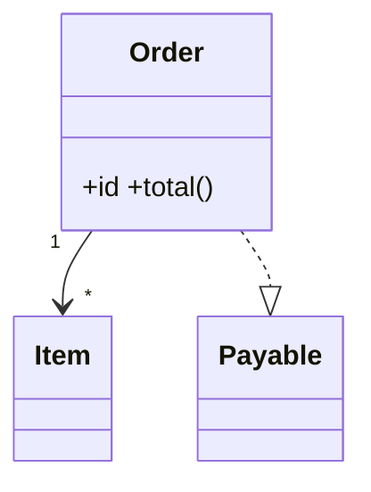
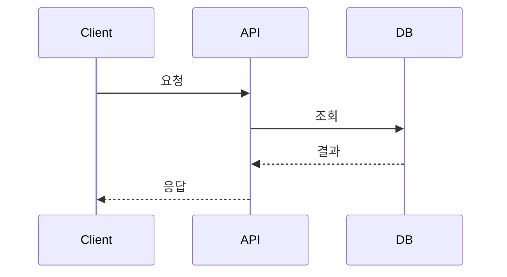
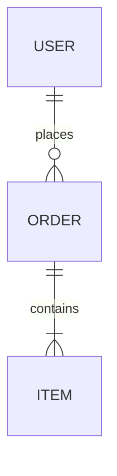
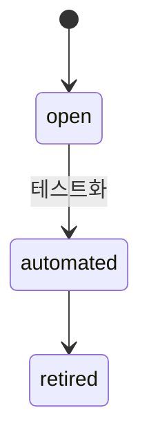
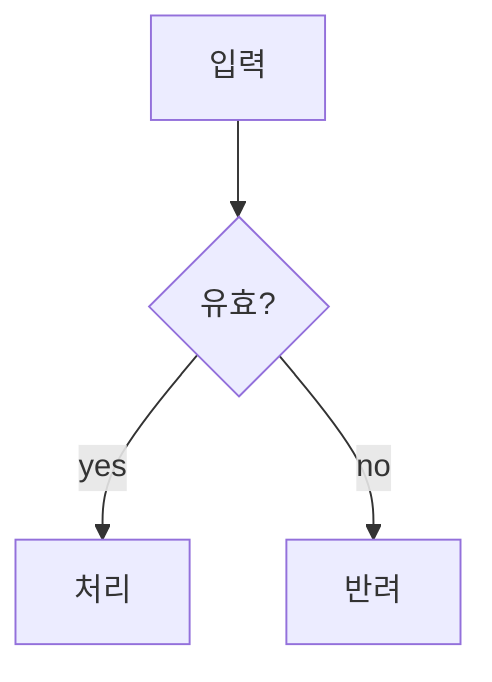

# 다이어그램 타입별 상세 · 안티패턴

## classDiagram

클래스·타입·도메인 모델의 상속, 구성, 인터페이스 관계를 표현한다.

## sequenceDiagram

인증·재시도·오류를 포함한 시간 순 호출 관계를 표현한다.

## erDiagram

엔티티와 카디널리티를 표현한다.

## stateDiagram-v2

상태와 허용된 전이를 표현한다.

## flowchart

로직·분기·파이프라인을 표현한다. 복잡한 영역은 `subgraph`로 묶는다.

## C4 / flowchart

Context → Container → Component 중 한 수준만 선택한다. 토폴로지는 노드를 장비·서비스로, 연결 라벨을 포트·프로토콜로 표현한다.

## 안티패턴

- 한 장에 여러 추상화 수준을 섞지 않는다.
- 수정할 수 없는 이미지만 남기지 않는다.
- 코드가 바뀌었는데 오래된 도식을 최신인 것처럼 두지 않는다.
- 구조 전달을 방해하는 장식과 색을 남용하지 않는다.
