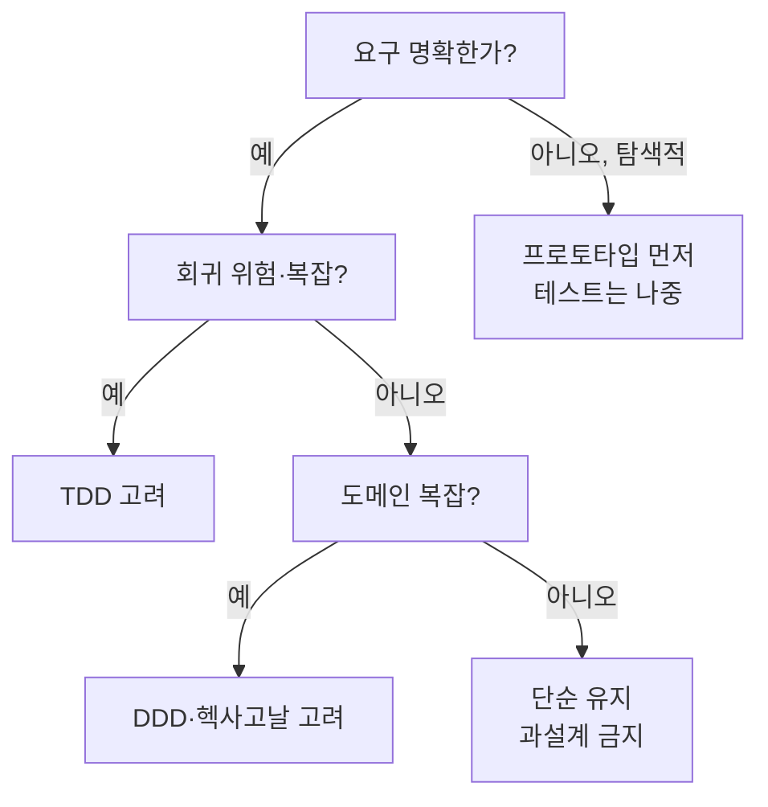

# ① 방법론·아키텍처 스타일 (메뉴)

프로세스·구조 수준. 각 **언제 적합 / 언제 아님**. 비처방이다 — 후보를 제시하고 선택은 사람이 한다.

## 개발 방법론 (프로세스)
| 방법론 | 언제 적합 | 언제 아님(오남용) | 실행 |
|---|---|---|---|
| **TDD** | 요구 명확·회귀 위험·로직 복잡 | 탐색적 프로토타입·UI 실험(테스트가 방해) | `odin:test-driven` |
| **타입 주도** | 불변식·상태를 타입으로 강제, 강타입 언어 | 동적·빠른 스크립트 | `odin:type-driven` |
| **계약(DbC)** | 명확한 pre/post/invariant·경계 신뢰 필요 | 내부 헬퍼 남발(계약 노이즈) | `odin:design-by-contract` |
| **검증 우선** | 상태머신·불변식·시간속성 먼저 | 단순 CRUD | `odin:validation-first` |
| **증명 주도** | 정확성이 치명적(금융·안전) | 일반 앱(과함) | `odin:proof-driven` |

## 아키텍처 스타일 (구조)
| 스타일 | 핵심 | 언제 적합 | 언제 아님 |
|---|---|---|---|
| **클린/헥사고날** | 도메인 중심, 의존성 역전(포트·어댑터) | 오래갈 도메인·외부의존 격리 | 작은 CRUD·프로토타입(보일러플레이트 과다) |
| **DDD** | 유비쿼터스 언어·바운디드 컨텍스트·애그리거트 | 복잡 도메인·큰 팀 | 단순 도메인(오버엔지니어링) |
| **CQRS** | 읽기/쓰기 모델 분리 | 읽기·쓰기 부하/모델 크게 다름 | 대칭적 단순 도메인(복잡도만↑) |
| **이벤트 드리븐** | 이벤트로 느슨 결합·비동기 | 통합 다수·확장·감사 필요 | 강한 일관성·단순 동기 흐름(디버깅 난이도↑) |
| **SOLID** | 객체 설계 5원칙 | 일반 OO 설계 지침 | 원칙 위한 원칙(과분할) |
| **12-factor** | 클라우드 네이티브 앱 규율 | 배포·확장·설정 외부화 | 순수 로컬 툴 |

## 선택 결정흐름 (예시 — `diagram`으로 그려 제시)

> 이건 **예시 트리** — 실제는 상황 맞춰 그린다. 강요 아님.

## 규율
- **오버엔지니어링 경고 우선** — 대부분 "언제 아님"이 더 중요. 단순함이 기본값.
- 유저 선호·프로젝트 규약({{AGENT_FILE}}) 반영. 여러 개 겹치면 조합도 가능(예: 헥사고날+DDD).
