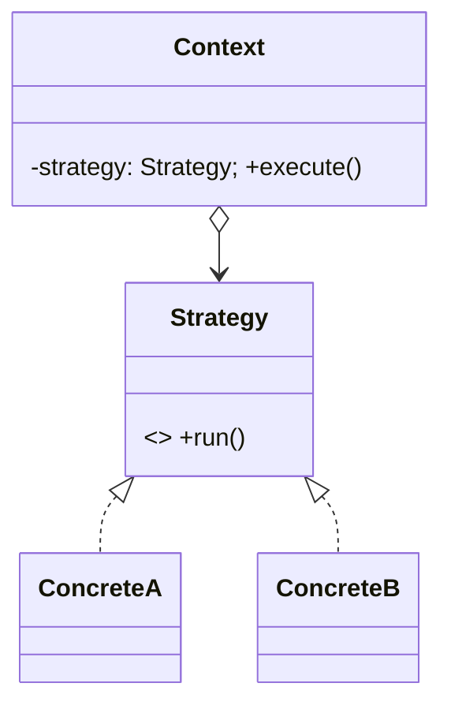

# ② 디자인 패턴 (메뉴)

코드 수준 해법. 각 **어떤 문제 / 언제 / 안티패턴(오남용)**. 비처방. **패턴 위한 패턴 금지** — 문제 없으면 안 쓴다.

## 생성 (Creational)
| 패턴 | 문제 | 언제 | 오남용 |
|---|---|---|---|
| **Factory Method / Abstract Factory** | 생성 로직 분리·계열 교체 | 타입 결정을 늦추거나 계열 스왑 | 단순 `new` 대체(과함) |
| **Builder** | 복잡·선택적 파라미터 조립 | 인자 多·불변 객체 단계 구성 | 필드 2~3개(그냥 생성자) |
| **Singleton** | 전역 단일 인스턴스 | 진짜 하나뿐(설정·풀) | **남용 위험**(전역상태·테스트 방해) → DI 고려 |

## 구조 (Structural)
| 패턴 | 문제 | 언제 | 오남용 |
|---|---|---|---|
| **Adapter** | 인터페이스 불일치 연결 | 외부 API·레거시 감쌈 | — |
| **Decorator** | 동적 기능 추가(상속 폭발 회피) | 조합 가능한 부가기능 | 래퍼 남발(디버깅 난이도↑) |
| **Facade** | 복잡 서브시스템 단순 창구 | 진입점 단순화 | 실제 결합 은폐만 하고 방치 |
| **Proxy** | 접근 제어·지연·캐싱 | 원격·지연로딩·권한 | — |

## 행위 (Behavioral)
| 패턴 | 문제 | 언제 | 오남용 |
|---|---|---|---|
| **Strategy** | 알고리즘 교체 | 런타임 정책 스왑 | 분기 2개(그냥 if) |
| **Observer** | 상태변화 구독·통지 | 이벤트·pub-sub | 통지 폭주·순환·누수 주의 |
| **State** | 상태별 행동 캡슐화 | 복잡 상태머신 | 상태 2개(과분할) |
| **Command** | 요청 객체화(undo·큐) | undo·매크로·큐잉 | — |
| **Template Method** | 골격 고정, 일부 훅 | 공통 흐름+변형점 | 상속 강제(Strategy가 나을 때) |

## 동시성·통합
- **동시성**: Producer-Consumer · Worker Pool · Future/Promise · Actor.
- **통합/메시징**: Message Queue · Pub-Sub · Saga(분산 트랜잭션) · Circuit Breaker · Retry/Backoff.
- 각 "언제": 부하 분산·비동기·장애 격리 필요 시. 오남용: 단순 동기로 될 걸 분산화(복잡도·디버깅 폭증).

## 구조도 예시 (`diagram`으로 그려 제시)
Strategy — 알고리즘 교체:

> 패턴 관계는 이렇게 **classDiagram**으로 보여준다(요청 시 diagram 위임). Observer·State 등도 동일.

## 규율
- **안티패턴 우선 경고**: 대부분 실수 = 안 필요한 패턴 삽입. "그냥 함수/조건문이면 되는가?" 먼저.
- GoF 외에도 문제에 맞으면 다른 패턴/무패턴. 이름 붙이기보다 **문제 해결**이 목적.
